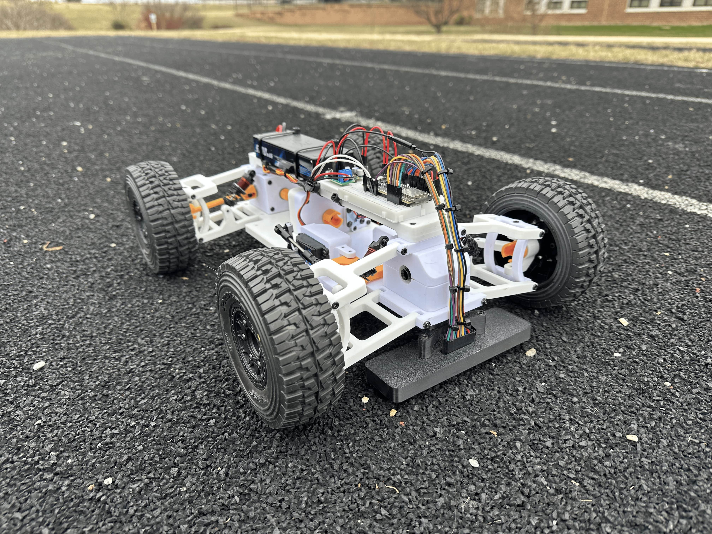

# pacer-v1
A 3D-printed, 1/10-scale autonomous pacer robot for track and field.

## Videos
https://github.com/user-attachments/assets/b290baa9-71bd-49d5-837f-d4e4456bcb18

https://github.com/user-attachments/assets/f611f2c6-a903-4dcb-a009-24ee0bf0cf6d

## Bill of Materials
| Quantity | Part Name |
|:------:|----------|
| 16 | 10x15x4mm Bearing |
| 2 | 5x10x4mm Bearing |
| 4 | M3 Tie Rod End |
| 1 | 35kg Servo |
| 1 | Servo Horn |
| 1 | Sensored Brushless DC Motor |
| 4 | Wheels |
| 1 | LiPo Battery |
| 1 | 120mm Timing Belt |
| 1 | 20T GT2 Timing Pulley |
| 1 | 40T GT2 Timing Pulley |
| 4 | 55mm Touring Shocks |
| 1 | Differential |
| 1 | Pinion Gear |
| 1 | Breadboard |
| 1 | ESP32-S3-DevKitC-1-N8R8 |
| 1 | Power Distribution Module |
| 1 | 5V Buck Converter |
| 1 | AS5600 |
| 1 | Diametrically Magnetized On-Axis Magnet |
| 1 | XT60 to T-Plug Adapter |
| 33 | Jumper Wires |
| 1 | 5V Buck Converter |
| | PETG Filament |
| | Differential Oil |
| | Shock Oil |

## Fastener List
| Type | Size | Length | Head | Quantity |
|------|------|--------|------|----------|
| Screw | M2 | 8mm | Button Head | 4 |
| Washer | M2 | | | 4 |
| Screw | M3 | 4mm | Socket Head | 10 |
| Screw | M3 | 8mm | Socket Head | 2 |
| Screw | M3 | 12mm | Socket Head | 21 |
| Screw | M3 | 16mm | Socket Head | 20 |
| Screw | M3 | 20mm | Socket Head | 6 |
| Screw | M3 | 25mm | Socket Head | 13 |
| Screw | M3 | 30mm | Socket Head | 1 |
| Screw | M3 | 35mm | Socket Head | 10 |
| Screw | M3 | 8mm | Button Head | 2 |
| Screw | M3 | 12mm | Button Head | 7 |
| Screw | M3 | 16mm | Button Head | 9 |
| Rod | M3 | 50mm | | 1 |
| Rod | M3 | 200mm | | 1 |
| Rod | M3 | | | 11 |
| Washer | M3 | | | 6 |
| Set Screw | M3 | | | 2 |
| Screw | M4 | 20mm | Socket Head | 4 |
| Nylon Locknut | M4 | | | 4 |

## License
This work is licensed under a [MIT License](LICENSE).
